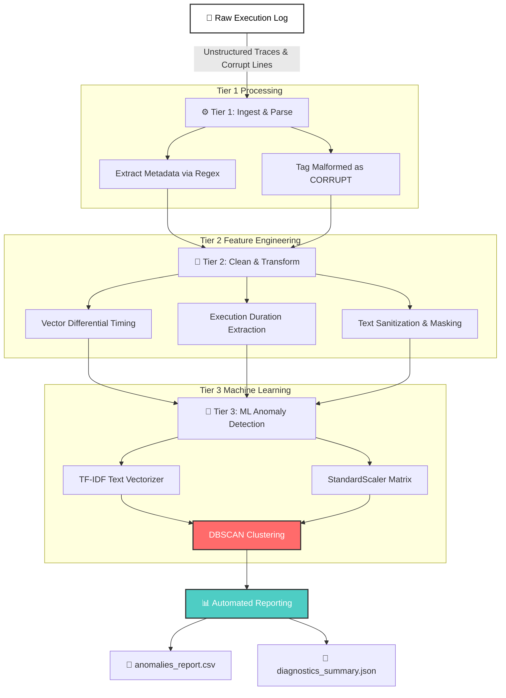

# ⚡ Automated Log Diagnostics & Anomaly Detection Pipeline

[](https://www.python.org/)
[](https://scikit-learn.org/)
[](https://pandas.pydata.org/)
[](https://numpy.org/)
[](https://opensource.org/licenses/MIT)

A production-grade, vectorized Python data pipeline designed to parse unstructured hardware and system execution logs, extract latency metrics, and isolate diagnostic anomalies using density-based unsupervised clustering (`DBSCAN`) and TF-IDF text vectorization.

---

## 📌 Context & Business Impact

During high-stress hardware validation runs (e.g., DDR5 PHY memory calibration, PCIe link training, embedded microcode execution), parsing multi-gigabyte log traces manually is inefficient and prone to missing subtle latency spikes. 

This repository provides an automated **3-Tier Data Hygiene Pipeline** that ingests raw log files, transforms unstructured text streams into standardized numerical feature matrices, detects timing anomalies using machine learning, and exports structured reports in CSV and JSON formats for downstream analytics platforms (such as Tableau or Power BI).

---

## 🏗️ Architecture & 3-Tier Data Flow

---

## 🔑 Key Features

* **Robust Parsing Engine:** Custom regular expressions dynamically segment timestamps, log levels (`INFO`, `WARNING`, `ERROR`, `CRITICAL`), sub-modules, and messages. Malformed lines without timestamps are categorized as `CORRUPT` without halting processing.
* **Vectorized Latency Tracking:** Uses `pandas` differential timing (`.diff()`) with median imputation to calculate execution delta times between consecutive operations without slow Python loops.
* **Hybrid Machine Learning Anomaly Detection:**
  * **Text Features:** Extracts message semantics using `TfidfVectorizer` while regularizing numerical noise and hex memory addresses (e.g., `0x7FFA4B` $\rightarrow$ `<NUM>`).
  * **Density Clustering:** Combines scaled text features with standardized execution latency metrics via `DBSCAN` to detect unscripted outliers (`cluster = -1`).
  * **Rule Overrides:** Hard-flags high-severity events (`CRITICAL`, `ERROR`) and severe execution spikes (> 3.0s).
* **Automated Export Pipeline:** Exports structured CSV anomaly reports and API-ready JSON payloads complete with execution metadata and summary metrics.

---

## 🛠️ Tech Stack & Dependencies

* **Language:** Python 3.10+
* **Data Processing:** `pandas`, `numpy`, `re`
* **Machine Learning & Feature Scaling:** `scikit-learn` (`DBSCAN`, `TfidfVectorizer`, `StandardScaler`)
* **Serialization & Storage:** `json`, `os`

---

## 🚀 Quickstart Guide

### 1. Clone Repository & Setup Virtual Environment
```bash
git clone [https://github.com/sivakami26/log-parsing-pipeline.git](https://github.com/sivakami26/log-parsing-pipeline.git)
cd log-parsing-pipeline

python -m venv venv
source venv/bin/activate  # On Windows: venv\Scripts\activate
2. Install DependenciesBashpip install pandas numpy scikit-learn
3. Run PipelineBashpython log_pipeline.py
📊 Sample Output & Diagnostics SummaryTerminal Summary OutputPlaintext=================== PIPELINE SUMMARY ===================
 -> Total Logs Processed: 16
 -> Valid Timestamp Logs: 15
 -> Detected Anomalies: 2
 -> Critical Errors: 1

=================== EXPORT COMPLETE ===================
 -> Anomalies CSV: log_exports/anomalies_report_20261007_163500.csv
 -> Diagnostics JSON: log_exports/diagnostics_summary_20261007_163500.json
Detected Anomalies Output TableLineLevelModuleDelta SecDuration (ms)Message9ERRORMemory4.95s4500.0msBuffer overflow detected at address 0x7FFA4C...10CRITICALSystem0.01s0.0msCore execution stalled unexpectedly...
📄 License

Distributed under the MIT License. See LICENSE for more information.

👤 Author: Sivakami Srinivasan

📫 Contact: LinkedIn | Portfolio Website
EOF
